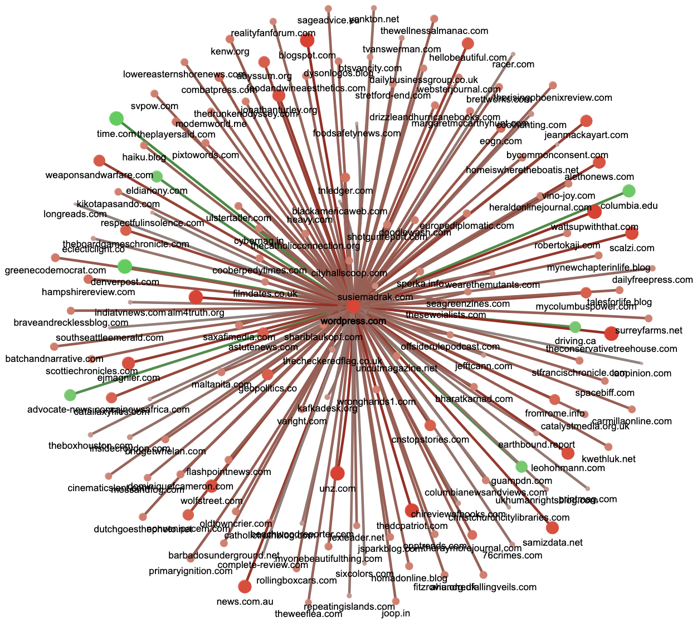

# :newspaper: Reliability Estimation of News Media Sources: *"Birds of a Feather Flock Together"* :bird:

:sushi: **Graph live demo [here](https://lab.idiap.ch/criteria/source_subgraph/wordpress.com)** _(double click on a node to navigate the graph)_

This repo contains all the needed files to download and process CC-News snapshot, extract different content from it (e.g. metadata, WET and CCNet-like json files), construct news sources graph, and estimate the reliability degrees using the four strategies described in [our NAACL paper](https://aclanthology.org/2024.naacl-long.383/).


---
### 😎 Computed Reliability Scores

JSON file with the estimated reliability degrees reported in the paper can be found in [`CC-NEWS/ALL/08/graph/en/reliability_scores.json`](CC-NEWS/ALL/08/graph/en/reliability_scores.json). This JSON files contain the list of URL domains and estimated scores (from -1 to 1) with each method. For instance, in Python we can simply use as:

```python
import json
with open("reliability_scores.json") as reader:
    sources = json.load(reader)
```
Adn then we can get the values for a given news media URL domain, for instance, for reuters.com:

```python
>>> sources["reuters.com"]
```
we should get something like:
```json
{
  "f-reliability": 0.8527098373020149,
  "p-reliability": 0.9976783452933727,
  "fp-reliability": 0.9971886886059202,
  "i-reliability": 0.997073479395713,
  "p+fp-average": 0.9974335169496464
}
```

We recommend using either `"p-reliability"` or `"p+fp-average"`, if you can evaluate them in downstream tasks, use the values to decide which one.

### :books: Ground Truth Dataset

The CSV file with the ground truth dataset described in the paper is located in [`data/golden_truth/golden_truth_dataset.csv`](data/golden_truth/golden_truth_dataset.csv). The CSV file contains for each news media url domain, its reliability label, the sources used to obtain the label, and its  NewsGuard score when it is available. The CSV structure is as shown in the following example with 6 rows:

|domain|reliability_label|newsguard_score|label_source|
| --- | --- | --- | --- |
|9news.com|1||mbfc|
|nbc11news.com|1||mbfc|
|24ur.com|0||mbfc|
|ft.com|1|100.0|newsguard|
|adfontesmedia.com|-1||wikipedia|
|foreignpolicy.com|1|87.5|newsguard|

We also provide the script `build_dataset.py` to build a potentially more updated version of this dataset which will take care of scraping the whole mediabiasfactcheck.com web site as of today to gather their current annotations, normalize them, and merge them with the other sources reported in the paper to generate a new version of this csv dataset.

### :pencil: Replicate Evaluation

First things first, setup the conda environment
```bash
# create and activate virtual python environment
conda create -n reliability python=3.7
conda activate reliability
pip install -r requirements.txt
```

Next, download the already processed CC-News files needed to construct the graph from [here](https://drive.google.com/file/d/1b_4SaG0sQtSmBPoFClnMG8fq6WXrUmWl/view?usp=sharing). Unzip the folders inside this file inside the `CC-News/` folder making sure you have the following 4 years inside the `CC-News` folder:

```
- CC-NEWS/
  |- 2019/
  |- 2020/
  |- 2021/
  |- 2022/
```

Everything ready! Now you can simply use the script to construct and evaluate the graph:
  - ExpsetB$^-$ (default parameters):
    ```bash
    python ccnews_create_graph.py
    ```
  - ExpsetB:
    ```bash
    python ccnews_create_graph.py golden_truth.include_mixed_in_reward=True
    ```

### :zap: Subgraph Visualization for a Given Domain

To visualize the subgraph containing only the sources linked to a given domain you can use the `generate_subgraph.py` script. For instance, to visualize the subgraph for [wordpress.com](wordpress.com) we can simply use:

```bash
generate_subgraph.py wordpress.com
```
This by default will create the file `subgraph-DOMAIN.html` (`subgraph-wordpress.com.html` in this case) inside the folder `CC-NEWS/ALL/08/graph/en/` containing the interactive plot. In this case this subgraph look like the following (live demo [here](https://lab.idiap.ch/criteria/source_subgraph/wordpress.com) - double click on nodes to keep navigating the graph):



For instance, here we can see that most media sources linking to [wordpress.com](wordpress.com) are unreliable. Red color correspond to unreliable sources, green to reliable, and gray to middle values. Additionally, node size correspond to the computed degree and edges width to the strength of the connection between the sources given by hyperlink volume.

Inside the `generate_subgraph.py` there are few parameters hard coded that can be changed, like showing only inbound links (default), outbound or both. Or changing the path to the desired graph to extract the subgraph.

> **NOTE:** the `generate_subgraph.py` script need to get access to the original graph file (the `graph_news.graphml` file) which is not included in this repo because it exceeds GitHub's file size limit of 100.00 MB, you will need to generate it first, before calling the script for the first time. To generate the needed file simply use: 
> 
> ```bash
> python ccnews_create_graph.py graph.evaluation=False graph.visualization.enable=False
> ```
> 
> The `graph_news.graphml` file should be now inside the `CC-NEWS/ALL/08/graph/en/` folder.


---
## :earth_americas: Want to create your own and larger 💪 Graph from CC-News?

We provide the following scripts that can be used to download and process CC-News snapshots to create the graphs:

1. `ccnews_get_snapshot.py` - download a CC-News snapshot given [the URL to snapshot WARC paths](https://data.commoncrawl.org/crawl-data/CC-NEWS/index.html) of the desired year and month (e.g. for 2019/08 we have https://data.commoncrawl.org/crawl-data/CC-NEWS/2019/08/warc.paths.gz).
2. `ccnews_extract_content.py` - extract/mine information from the downloaded snapshot (e.g. WET and CCNet-like json files and metadata used, for instance, for building the news source graph).
3. `ccnews_create_graph.py` - using the metada files produced up to this point, creates and saves the graph and computes the reliability scores (optionally, it al runs the evaluation and creates an interactive HTML graph visualization).

**NOTE:** The first script is only needed in case there's a need to download multiple snapshots in parallel by different jobs since the second script (`ccnews_extract_content.py`) already contains the logic to download the snapshot in case it is not found in the system.

### :octopus: How to use

To process a CC-News snapshot from certain year and month, the process is the following:
  1. Go to [the Common Crawl News Dataset](https://data.commoncrawl.org/crawl-data/CC-NEWS/index.html) and copy the url of the desired year and month WARC file paths from the "WARC file list" column (e.g. https://data.commoncrawl.org/crawl-data/CC-NEWS/2021/01/warc.paths.gz for 2021/01).
  2. Either paste that url in the `snapshot.paths_url` field of the `config.yaml` file or pass it as an argument to the script.
  3. Run `ccnews_extract_content.py` script that will extract the needed information for creating the indexes and the news sources graphs (default `config.yaml` values are set so that only the minimun and required files will be generated/extracted).
  4. Finally, run the `ccnews_create_graph.py` to construct the graph and compute and save the reliability scores.

For example, let's say I want the graph for January 2024, so first I need to download and process the snapshot "CC-News/2024/01" to extract the needed information to construct the graph with:

```bash
python ccnews_extract_content.py snapshot.paths_url="https://data.commoncrawl.org/crawl-data/CC-NEWS/2024/01/warc.paths.gz"
```
_(this process will take some time since CC-news snapshots are typically huge, so it is better if you can parallelis this process as described later in the "Configuration file" section)_

Finally, we can construct our graph for January 2024:

```bash
python ccnews_create_graph.py snapshot.paths_url="https://data.commoncrawl.org/crawl-data/CC-NEWS/2024/01/warc.paths.gz"
```
By default this script will not only construct the graph, compute and save the reliability score but, at the end, it will also perform the evaluation described in the paper.

**Note:** using "ALL" in place of the year (e.g. `snapshot.paths_url="https://data.commoncrawl.org/crawl-data/CC-NEWS/ALL/01/warc.paths.gz"`), will make this script to construct a single graph joining all the graphs of each already processed year.


### :cookie: Output

Scripts will store the output result in a local folder following the same structured as of the snapshot url. That is, suppose in step 1 of the previous section we use the following url https://data.commoncrawl.org/crawl-data/CC-NEWS/2022/01/warc.paths.gz, here we can see that in the URL the file is stored remotely in `CC-NEWS/2022/01/`, then, locally the output will be stored in:

Output folder:
```
- CC-NEWS/
  |- 2022/
    |- 01/
```
Therefore, if later a different year/month is added, let's say 2023/01, we'll have:
```
- CC-NEWS/
  |- 2022/
  |  |- 01/
  |- 2023/
     |- 01/
```
That is, each snapshot will have each unique local output folder mimicking the remote URL structure.

Inside this output folder will be downloaded the given `warc.paths` and its subsequents `.warc` files.
In addition, files generated by pipeline scripts that only depend on the given snapshot will also be stored there. Namely, depending which options are enabled in the config file, `ccnews_extract_content.py` script will create any or all `metadata`, `wet`, `domains`, `graph`, and/or the `ccnet_json` folder to store the extracted outputs. For instance, in the example above we could have:

```
- CC-NEWS/
  |- 2022/
    |- 01/
      |- wet/
      |- graph/
      |- domains/
      |- metadata/
      |- ccnet_json/
```
In addition, except for `wet`, these folders will be split and grouped by language (after language identification) inside its respective folder. For instance, for "graph" we could have:

```
- CC-NEWS/
  |- 2021/
    |- 01/
      |- wet/
      |- graph/
        |- en/
        |- es/
        ...
```

Finally, in the `config.yaml`, using the `graph.lang` parameter one can specify the target language to construct the graphs on the generated data.

The "graph" folder will contain the graph saved as a graphml file (`graph_news.graphml`), the list of all news domains and node index pairs as a TSV file (`domain_ix_news.tsv`), the HTML file (`graph_news.html`) with an interactive visualization of the graph, and last but not least, the `reliability_scores.json` files containing the computed values for all the news media domains in the graph.

### :electric_plug: Configuration file

This project uses [`hydra`](https://hydra.cc/) to take care of configuration files. Below is an example of our main configuration file (`config.yaml`) whose correct understanding allows more advanced usecases:

```yaml
snapshot:
  paths_url: "https://data.commoncrawl.org/crawl-data/CC-NEWS/ALL/08/warc.paths.gz"  # url to file with paths to WARC files
  url_split: "crawl-data/"  # string used to split CC-news urls into domain and local path
extract:
  lang_filter: ["en"]
  index: False
  news_sources: True  # the only one needed for graph creating
  metadata: False
  wet: False # wheather or not to also generate WET files from the downloaded WARC files
  ccnet_json: False
  remove_originals: True  # whether or not to remove original warc files after they were processed

golden_truth:
  output_path: "data/golden_truth/"
  output_file: "golden_truth_dataset.csv"
  include_mixed_in_reward: False
  ...
clean_cache: False
graph:
  lang: "en"
  evaluation: True
  join_graphs: True  # wheather or not to create a single graph joining all available graphs (across years and months)
  target_graph: ['news']  # valid values are 'news' or 'all' (if news only keep news media nodes in the graph)
  news_sources:
    ignore: ["google.com", "youtube.com", "twitter.com", "facebook.com", "reddit.com", "amazon.com"]
    filter:
      targets: []  # analyze only the subset of news given here
      include_neighbors: True
  visualization:
    enable: True
    graph:
      edge:
        min_fr: 50  # in case of using filter, it's better to set it to a small value like 1
        max_width: 10
        min_width: 4
      node:
        min_size: 10
        max_size: 100
    color:
      reliable: "#1e88e5"
      unreliable: "#e53935"
      unknown: "#bdbdbd"
job:
  id: 0
  max: 1
```

As can be seen, paratemers are organized in a hierarchy and can be overwritten from the command line when calling any script, for instance, suppose we want to download a different snapshot, then we can call the script with a different value for the first parameter in the example above (`snapshot.paths_url`) from the command line argument, as follow:

```bash
python ccnews_get_snapshot.py snapshot.paths_url="https://data.commoncrawl.org/crawl-data/CC-NEWS/2022/01/warc.paths.gz"
```

Using the last two fields from the config file shown above (`job.max` and `job.id`) we can also manually run multiple parallel instances. For instance, suppose we want to extract the content of the downloaded snapshot using 4 parallel processes, we can simply do:

```bash
python ccnews_extract_content.py job.max=4 job.id=0 &
python ccnews_extract_content.py job.max=4 job.id=1 &
python ccnews_extract_content.py job.max=4 job.id=2 &
python ccnews_extract_content.py job.max=4 job.id=3 &
```

Note that this is just an illustrative example, in real life these scripts are meant to be run on Sun Grid Engine using (SGE) job arrays or Slurm. For instance, the same example can be executed using SGE's `qsub` as follow:

```bash
qsub -t 1:4 python.job ccnews_extract_content.py
```

Idially, to take advantaje of massive parallelisation, we can create a job for each WARC file, for instance, if we have 324 WARC files, we can run 324 jobs each will process a different WARC file:

```bash
qsub -l q_1day -o logs -j y -t 1:324 python.job ccnews_extract_content.py
```
Note, here the flags `-o` and `-j` are being used to redirect the output to the `logs` folder and to merge error and standard output, respectively (so it can be ignored).

---
## :speech_balloon: Citation

```bibtex
@inproceedings{burdisso-etal-2024-reliability,
    title = "Reliability Estimation of News Media Sources: Birds of a Feather Flock Together",
    author = "Burdisso, Sergio  and
      Sanchez-cortes, Dairazalia  and
      Villatoro-tello, Esa{\'u}  and
      Motlicek, Petr",
    editor = "Duh, Kevin  and
      Gomez, Helena  and
      Bethard, Steven",
    booktitle = "Proceedings of the 2024 Conference of the North American Chapter of the Association for Computational Linguistics: Human Language Technologies (Volume 1: Long Papers)",
    month = jun,
    year = "2024",
    address = "Mexico City, Mexico",
    publisher = "Association for Computational Linguistics",
    url = "https://aclanthology.org/2024.naacl-long.383",
    pages = "6893--6911",
}

```